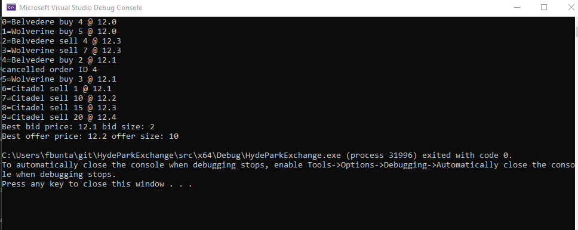

# Hyde Park Exchange
Om Suchak & Finnian Bunta

## Overview

In this project, Om and Finn wrote the beginnings of the key framework for a new exchange we dub the “Hyde Park Exchange” or HPX. At a high level HPX will ingest FIX messages and parse them using CTRE. Each trading session gets its own thread and will use an order factory to create order objects that are eventually placed into the data structures of the live exchange. The orders are queued for each price and filled by the FIFO method when an opposite order is placed. Cancellation functionality is also supported as well for every trading session thread. Lastly, each trading session can consume a fill stream that informs the thread of orders that have been filled just for that trading entity.

## Build/Configuration Instructions

We support two ways of building and running the project.
1. Visual Studio
2. CMake

## Functionality Delivered

When this project is compiled and run out of the box this is an example of what the console output could be.

Note it could be different because of some variance in threads processing timing but this is roughly what it should look like.

First Wolverine and Belvedere place a series of orders with IDs in this of 0-5, which make the market $12.1 bid $12.3 offer which means that the market shows the highest price someone is willing to buy is $12.1 and the lowest price someone is willing to sell is $12.3. The bid size is 5 and the offer size is 11.

Now imagine some news comes out or another asset correlated to this one dips. Belvedere Trading realizes this and no longer wants to buy for as high as $12.1 so cancels order id 4 which probably was ahead of Wolverine's order 5. Now Citadel comes in with a sell order of $12.1 for a 1-lot which will instantly cross with order 5. We have evidence that the cancel functionality worked as expected because the file Wolverine.out displays the fill:

`Wolverine Fill 5 BUY 1 @ 12.1`

At the very end of the run after we tear down all the threads we print the market prices that we as an exchange want to be public information. We can see that the best bid price is still $12.1 but the size is only 2. That is because order 5 was partially filled and the remaining quantity is still sitting there at the head of the queue.

## Advanced C++ Techniques Used

1. Abstract factory
    * Finn used an abstract factory to create limit and market orders using the design patterns we learned about in class.
2. Compile time regular expressions
    * Om used HannikaDot’s CTRE class to vastly improve the time-performance while reading FIX messages—the real standard for market messages as explained to us by Matt Godbolt
3. Streams
    * To create a file stream that filters filled orders for a single given trading entity, Finn used the ios_base::xalloc to store a pointer to the trading_entity object and wrote an I/O manipulator that checks a fill object’s entity against this static value in memory before deciding to write to the stream.
4. Variant-visitor
    * Om made use of the variant-visitor pattern for the order-side method of the order object, since Buy and Sell should effectively take the same amount of space, we could use them in a std::variant and visit when needed. 
5. Producer-Consumer
    * Finn implemented two producer consumer patterns to handle threads passing information to one another. One is for orders coming into the exchange - we wanted every trading session to have its own thread, but Finn did not want every thread touching the tree and queues. So a single consumer thread actually touches the tree and queues and threading sessions simply produce orders for this consumer.
    * The second producer-consumer is for fills. This opens the door for each trading session being able to consume its own fills. See the stream section for more on this.
6. Custom concepts and advanced type-traits
    * Examples of concepts and type traits used: a hashable custom concept for the Bloom Filter, is_same_v, convertible_to, decay_t, …
7. Doubly linked queue data structure
    * Finn considered doing an array based approach for ensuring FIFO functionality but ultimately the high functionality requirements led Finn to opt for a doubly linked queue. Doubly linked because cancellation needs to pop from the middle of the queue.
8. Binary tree data structure
    * To handle all the prices that orders can place, Finn decided to use a binary tree with the nodes as queues. This common data structure allows for the order insertion/cancellation thread and the fill thread to traverse the tree quickly without needing locks on the tree itself.
9. Concurrency
    * In the order ID singleton and the price queues, concurrency was the focus and getting it right took some thought. The scoped lock for fills ended up working very nicely as well as the atomics in the order ID generation.
10. Bloom Filter code (not integrated)
    * Uses manipulations on std<hash> using the magic number and some offsetting shifts to create k hash functions for a custom bloom filter implementation.

## Potential Expansions / Reflections
* One major flaw of the exchange from a functional stand-point is that a trading session can put an order at any price queue it wants. We need some logic to handle an order coming in for BUY @ $10 when the best offer price is $9 - that order needs to get adjusted to BUY @ $9 and get filled immediately.
* We planned to get functionality of market and immediate-or-cancel order types but it was such a big lift getting limit orders to work that we ran out of time.
* As a potential expansion, we could integrate multiple assets (E.g. the entire SPX option chain of 200+ securities) and incorporated the Bloom Filter code for fast lookup. 
* A velocity control for the exchange, so that some company can’t just flood the orderbook with their orders and prevent others from trading (e.g. a restriction of 10 orders per millisecond)
* A realtime stream of best bid and offer with sizes that everyone can see.
